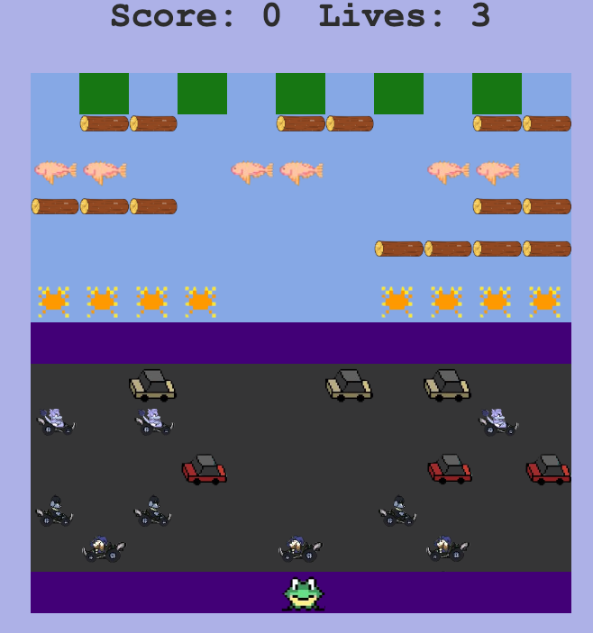
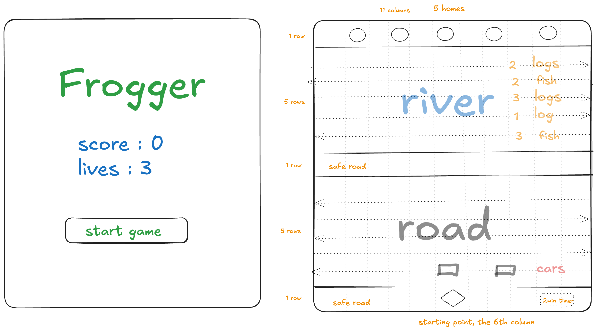

# Frogger

Description: Frogger is a browser-based Frogger-style arcade action game. The object of the game is to direct five frogs to their homes by avoiding cars on a busy road, then crossing a river by jumping on floating logs. Use arrow keys to move the frog. Avoid cars and jump on logs to reach home! I created this game as my first project in the General Assembly Software Engineering Bootcamp of learning JavaScript DOM manipulation and JavaScript Array Iterator Methods. It was developed using HTML, CSS, and JavaScript.



## Deployment link

https://bihuiy.github.io/Frogger/

## Getting Started / Code Installation

To play the game, simply open the deployed link in your browser.

## Timeframe &amp; Working Team (Solo/Pair/Group)

This project was completed individually over one week, from 27th June to 4th July 2025.

## Technologies Used

**Front End**: HTML, CSS, JavaScript

**Development Tools**: Visual Studio Code, GitHub

## Brief

Render the game in the browser using the DOM manipulation techniques, and include win/loss logic and render win/loss messages in HTML.

## Planning

### 1. Pseudocode

Created pseudocode for frog movement, car and log animation, collision detection, and score/lives updates.

```
/*--------------------------------- Pseudo ---------------------------------*/
// * Considerations:
// 1. One player
// 2. Frog can move up, down, left and right

// * Inputs (user submitted or computer generated)
// 1. Click start button
// 2. Press arrow keys

// * Variables & State (think scores, choices, timers, lives etc)
// 1. Score - Start from 0, increase by 100 each time a frog successfully crosses the river and lands on the correct spot(a frog home).
// 2. Lives - Start from 3, decrease by 1 each time fails
// 3. Timer - A 2-min timer starts when a frog is reset at the starting point. Timer stops when the frog successfully crosses the river, fails from a collision, or fails to reach the correct spot within 2 minutes.
// 4. Cars - Moving cars appear on the road in the bottom half of the screen when the game starts. Five rows move either left or right. The frog must avoid these cars — if it gets hit, it loses one life.
// 5. Logs & fish - Floating logs and swimming fish appear in the river in the top half of the screen when the game starts. Five rows move either left or right. The frog must jump onto the logs or fish to cross safely — if it falls into the river, it fails and loses one life.
// 6. Five frog homes - at the very top of the screen.

// * User Interactions (user initiated events like clicks, hovers, key presses etc)
// 1. Player initiated the game by clicking start button
// 2. then player presses the arrow keys to move the frog to cross the road and river to reach to the five frog homes.

// * Core Logic / Rules (List the core rules that will dictate the win lose condition)
// 1. Frog must cross the road and river to reach one of the five homes.
// 2. If frog reaches an empty home, score increases by 100.
// 3. If frog is hit by a car on the road, lose one life.
// 4. If frog jumps into water without landing on a log or fish in the river, lose one life.
// 5. If frog reach to a home that is already occupied, lose one life.
// 6. If frog fails to reach a home within 2 minutes, lose one life.
// 7. Game ends when lives equal to 0 or all 5 frogs reach to 5 homes / score equals to 500.

// * Conditions / Branching (which conditions will lead to which things happening)
// 1. If score = 500, player wins
// 2. If lives = 0, game over
// 3. If frog touches car, river or a filled home, lose 1 life and reset frog (When the frog resets, it returns to the starting position at the center bottom of the screen.)
// 4. If frog not home within the timer ends, lose 1 life and reset frog

// * Loops (if any) (does any logic repeat? For example a ticking timer or in a game of poker maybe multiple computer choices generated on a loop)

// * Outputs / Feedback (What will the app output to the screen)
// Player's score
// Player's lives
// Win or lose message
```

### 2. Sketch

Sketched a basic layout of the game grid (13 rows x 11 columns). Defined each row's role: safe zones, river, roads, and home areas.



## Build / Code Process

Below is my detailed day-by-day breakdown of the development process.

### Backlog (Planning Stage)

- 6/28: Completed **Pseudocode**, and **Sketch**

### In Progress (Development Stage)

- 6/30: Completed the grid creation and implemented frog movement function <sup>[code snippet 1: Implement Frog Movement]</sup>
- 7/1: Built the moving cars and floating logs <sup>[code snippet 2: Built the moving cars and floating logs]</sup>
- 7/2: Implemented collision detection (cars, river areas)

### Review (Testing & Iteration)

- 7/3:
  - Added sound effects
  - Fixed the "reset home" bug
  - Completed CSS styling and layout

### Done

- 7/4: Added won and lose messages

### Code Snippets

1. Implement Frog Movement:

**Goal:** Control the frog move by keyboard. I added an event listener to listen for arrow keys keydown events and update the frog’s position within the grid.

```js
function moveFrog(event) {
  // Remove the frog from the old position
  removeFrog();

  // Calculate frog's current/new position based on the keys pressed
  const keyPressed = event.code;
  if (keyPressed === "ArrowUp" && currentPosFrog - columns >= 0) {
    currentPosFrog -= columns;
  } else if (
    keyPressed === "ArrowRight" &&
    (currentPosFrog + 1) % columns !== 0
  ) {
    currentPosFrog++;
  } else if (keyPressed === "ArrowLeft" && currentPosFrog % columns !== 0) {
    currentPosFrog--;
  } else if (
    keyPressed === "ArrowDown" &&
    currentPosFrog + columns < cellCount
  ) {
    currentPosFrog += columns;
  }
  // After position changes, add the frog on the new position
  addFrog();
}
```

2. Built the moving cars and floating logs:

**Goal:** Initially, I wrote a separate movement function for each car. Once I noticed the logic was nearly identical, I refactored it into a reusable `movingCar()` function that takes in parameters for direction and range.

```js
function movingCar({ carClassname, direction, startPos, endPos }) {
  let restartPos;
  if (direction === "left") {
    restartPos = endPos + columns - 1;
  } else {
    restartPos = endPos - columns + 1;
  }

  let currentPos = startPos;
  cellElement[restartPos].classList.add(carClassname);

  const intervalId = setInterval(() => {
    cellElement[currentPos].classList.remove(carClassname);
    if (
      (direction === "left" && currentPos > endPos) ||
      (direction === "right" && currentPos < endPos)
    ) {
      if (direction === "left") {
        currentPos--;
      } else {
        currentPos++;
      }
      if (currentPos === currentPosFrog) {
        removeFrog();
        checkLives();
      }
      cellElement[currentPos].classList.add(carClassname);
    } else {
      cellElement[restartPos].classList.add(carClassname);
      currentPos = restartPos;
    }
  }, 600);
  intervalIds.push(intervalId);
}
```

For logs, I introduced more complex logic, including multi-cell movement and memory of current positions using arrays. I encapsulated this logic into a generalized `floatingLog()` function.

```js
function floatingLog({
  logClassname,
  direction,
  startPos,
  endPos,
  numberOfLogs,
}) {
  resetLog(startPos, logClassname);
  let currentPos = [...startPos];
  allLogPositions.push(currentPos);
  let restartPos;
  if (direction === "left") {
    restartPos = [endPos + columns - 1];
  } else {
    restartPos = [endPos - columns + 1];
  }

  const intervalId = setInterval(() => {
    const length = currentPos.length;
    let head = currentPos[0];
    let tail = currentPos[length - 1];

    // Expanding - the movement of three fish appear one by one from the right starting point
    if (
      (direction === "left" && head > endPos && length < numberOfLogs) ||
      (direction === "right" && head < endPos && length < numberOfLogs)
    ) {
      if (direction === "left") {
        currentPos.unshift(head - 1);
      } else {
        currentPos.unshift(head + 1);
      }
      cellElement[currentPos[0]].classList.add(logClassname);
    }
    // Sliding - the movement of three fish swimmming from right to left together
    else if (
      (direction === "left" && head > endPos) ||
      (direction === "right" && head < endPos)
    ) {
      if (direction === "left") {
        head--;
      } else {
        head++;
      }
      cellElement[head].classList.add(logClassname);
      cellElement[tail].classList.remove(logClassname);
      currentPos.pop();
      currentPos.unshift(head);
    }
    // Disappearing - the movement of three fish disappear one by one from the left ending point
    else if (
      (direction === "left" && tail >= endPos) ||
      (direction === "right" && tail <= endPos)
    ) {
      if (direction === "left") {
        head--;
      } else {
        head++;
      }
      cellElement[tail].classList.remove(logClassname);
      currentPos.pop();
    } // The movement of three fish start from the right starting point
    else {
      resetLog(restartPos, logClassname);
      //currentPos = [...restartPos];
      currentPos.length = 0;
      restartPos.forEach((pos) => currentPos.push(pos));
    }

    checkFrogOnLog(currentPos);
  }, 800);
  intervalIds.push(intervalId);
}
function resetLog(startPos, logClassname) {
  for (i = 0; i < startPos.length; i++) {
    const element = startPos[i];
    cellElement[element].classList.add(logClassname);
  }
}
function checkFrogOnLog() {
  // Check whether the log has the frog on it
  const frogInRiver = isFrogInRiver();
  const frogOnAnyLog = allLogPositions.some((logPos) =>
    logPos.includes(currentPosFrog)
  );
  if (frogInRiver && !frogOnAnyLog) {
    removeFrog();
    checkLives();
  }
}
```

## Challenges

Backgrond: One of the most significant challenges I faced was managing the movement logic for multiple cars and logs on the river. Initially, I wrote individual functions for each car/log, and each had its own start position (startPos) and current position (currentPos). While this worked, it led to a lot of repetitive code, and it became inefficient and error-prone when I needed to update the logic.

Issue: I then attempted to restructure my code by creating more generic functions for each river row. I passed in the startingPos and currentPos as parameters. For example, in my `movingLogs()` function, I called swimmingLeftFish1(startingPosLeftFish11, currentPosLeftFish11) and similar functions for different logs and fish. This approach helped reduce code repetition by reusing logic, but I soon encountered issues when passing in arrays as arguments into the same function for different logs. I noticed a strange bug: when the frog landed on a log, the game treated it as a fail, even though landing on a log should be safe.

Analysis: To investigate, I added `console.log()` statements to print out the frog’s current position and the current position array of the logs when the frog landed on them. That’s when I discovered the log’s position array was incorrect. It wasn’t representing the actual position of the logs at that moment, which led to the faulty game logic. This led me to realize there was an issue with how I was handling arrays — I was accidentally sharing references between multiple logs on the same river row, causing them to overwrite each other's state.

Solution: To solve this, I encapsulated each log in an object with its own startPos, currentPos, and direction. By wrapping each instance inside an object and passing that object into the shared function, I ensured each entity maintained its own internal state. This eliminated the reference-sharing issue and made the game logic much more stable and maintainable.

## Wins

One of the most satisfying moments of this project was abstracting all the logs movement logic into a single reusable `floatingLog()` function. Initially, I had separate movement functions for each individual log, which resulted in a lot of repetitive code and was hard to maintain. As I progressed, I noticed that although the start positions, directions, and number of log segments varied, the underlying movement pattern was the same.

To create the final reusable `floatingLog()` function, I compared two different log movement functions — one for logs floating to the left and one to the right, each with different segment lengths. By identifying the shared patterns and differences, I was able to consolidate the logic into a single, flexible function that covers all log movement scenarios, regardless of direction or log length.

The final general-purpose `floatingLog()` function accepts parameters as below:

- logClassname: the class name of the log or fish
- direction: left or right
- startPos: an array of starting positions
- endPos: the point at which the log disappears
- numberOfLogs: how many cells the log should occupy

This function now handles the expansion, sliding, and disappearing phases of the log animation, while also resetting positions once a cycle is complete.

## Key Learnings / Takeaways

At the beginning, I wrote the code strictly following my pseudocode step by step, which made it hard to see the overall structure from the start. I imagined myself playing the game and wrote the code in the order things happened. For example, I created a separate function for each car and each log as I encountered them one by one.

After finishing these individual functions and making sure everything worked well, I stepped back to look at the project from a bigger perspective. I realized there was a lot of repetition in the code, so I refactored it by creating more general, reusable functions based on the duplicated logic.

If I had tried to write these general functions from the beginning, I don’t think I would have been able to do it. The process of building the detailed code first, then refactoring to generalize, was crucial for me to understand and improve the project.

## Future Improvements

Add a 2-min timer, starts when a frog is reset at the starting point. Timer stops when the frog successfully crosses the river, fails from a collision, or fails to reach the correct spot within 2 minutes.
